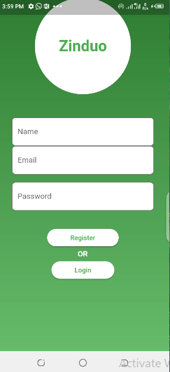
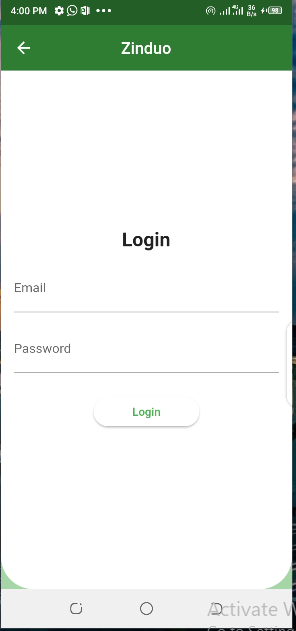
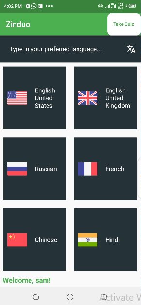

# ZINDUO: LEARN, QUIZ and EXCEL!

<!--  -->

Welcome to Zinduo, an innovative mobile application designed to enhance the language learning experience of users using quizzes, Flash cards and user flexibility of learning any word they wish to in other languages

Zinduo app aims to ease language learning with interactive learning session and making learning fun.

 

### Table of Content

- [Introduction](#introduction)
- [Installation](#install)
- [Features](#features)
- [Technology](#technology)
- [Usage](#usage)
- [In-App Screens](#in-app)
- [Future Plans](#future-plans)

 

------

##  Introduction

Zinduo is an innovative mobile application aimed at enhancing Users Language learning process

### IMPACT

This app has a huge impact to influence how we view the world through hands on practical language learning process removing language barriers and setting a new platform for people to thrive.

 

## Installation

Downlad the app from playstore here 

If you wish to build codes locally, clone this repository with the command
- first, copy the link to the repository
- git clone (link to repository)
- cd/ into the directory of the cloned repository, this is the original name of the cloned repo otherwise rename by you
- open the project in your favourite editor
- In the terminal cd into the root project directory, select an android emulator and run the command
- flutter run -- this command will download all the dependencies needed for the project to work and the app should be live on your android emulator

- Testers can use this test email id and password to test the working feature of the app
  - test email id: ken@gmail.com
  - test password: kenneth@1234
 

## Features

1. **Translation to Multiple Languages**: Learn in multiple languages by translating into other languages with ease.

2. **Interactive Quiz Learning**: Take quiz to test your learning process and see how much you are doing by grading yourself through interactive quiz session.

3. **Flash Cards Learnng**: Use flash cards to quickly remember what you have learnt and take a note of it.

## Technologies Used

1. Appwrite Cloud
- authentication
- database
- realtime 

2. Flutter
3. Google Translate API

##  Usage

Our app offers a Screen for better user experience and accessibility:

1. **Language Learning Screen**: Designed for users to start learning, the Language Learning screen provides ease of use and flash cards support plus interactive quiz session.

 

##  In-App Screens

### Registration screen

### Login screen

### User screen

 

## Future Plans

1. Improve the UI/UX of the Zinduo app.
2. Make the app available in multiple languages to increase usability.
3. Collaborate with government and companies to make the app accessible to more people .
4. Add a Feature to allow learners share their progress with users online.

 

### All of the source codes are available here.

- ZINDUO APP SOURCE CODE [@nnam-droid12](https://github.com/nnam-droid12/zinduo)

 